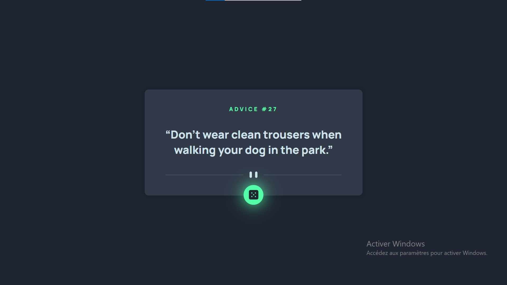

# Frontend Mentor - Advice generator app solution

This is a solution to the [Advice generator app challenge on Frontend Mentor](https://www.frontendmentor.io/challenges/advice-generator-app-QdUG-13db). Frontend Mentor challenges help you improve your coding skills by building realistic projects.

## Table of contents

- [Overview](#overview)
  - [The challenge](#the-challenge)
  - [Screenshot](#screenshot)
  - [Links](#links)
- [My process](#my-process)
  - [Built with](#built-with)
  - [What I learned](#what-i-learned)
- [Author](#author)

**Note: Delete this note and update the table of contents based on what sections you keep.**

## Overview

### The challenge

Users should be able to:

- View the optimal layout for the app depending on their device's screen size
- See hover states for all interactive elements on the page
- Generate a new piece of advice by clicking the dice icon

### Screenshot

This is a screenshot of my own solution 

### Links

- [Solution URL](https://bit.ly/3cM5L3t)
- [Live Site URL](https://bit.ly/3zdnGrb)

## My process

### Built with

- CSS custom properties
- Flexbox
- Mobile-first workflow
- JS fetch api

### What I learned

I learned how to use fetch api and javascript promises in a real use case alongside with javascript DOM
I used in this project the [Advice Slip API](https://api.adviceslip.com) to generate random advises

## Author

- Frontend Mentor - [@Ninou01](https://www.frontendmentor.io/profile/Ninou01)
